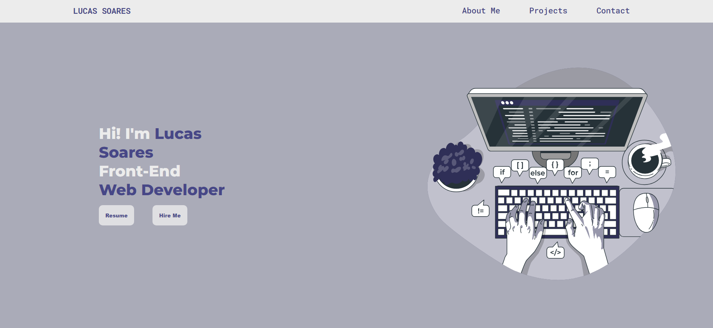

<h1 align="center"> Portfólio </h1>

Portfólio de contato com meus projetos  

  <a href="#-tecnologias">Tecnologias</a>&nbsp;&nbsp;&nbsp;|&nbsp;&nbsp;&nbsp;
  <a href="#-projeto">Projeto</a>&nbsp;&nbsp;&nbsp;|&nbsp;&nbsp;&nbsp;
  <a href="#-layout">Layout</a>&nbsp;&nbsp;&nbsp;|&nbsp;&nbsp;&nbsp;
  <a href="#memo-licença">Licença</a>

  

 

  

## 🚀 Tecnologias

Esse projeto foi desenvolvido com as seguintes tecnologias:

- HTML e CSS
- Git e Github
- Figma (para ideia inicial/rascunho)

## 💻 Projeto

É um portfólio simples e direto, com contatos, informações, projetos e o meu currículo.

- [Acesse o projeto finalizado, online](https://devlusket.github.io/portfolio/)

## :memo: Licença

Esse projeto está sob a licença MIT.

---
